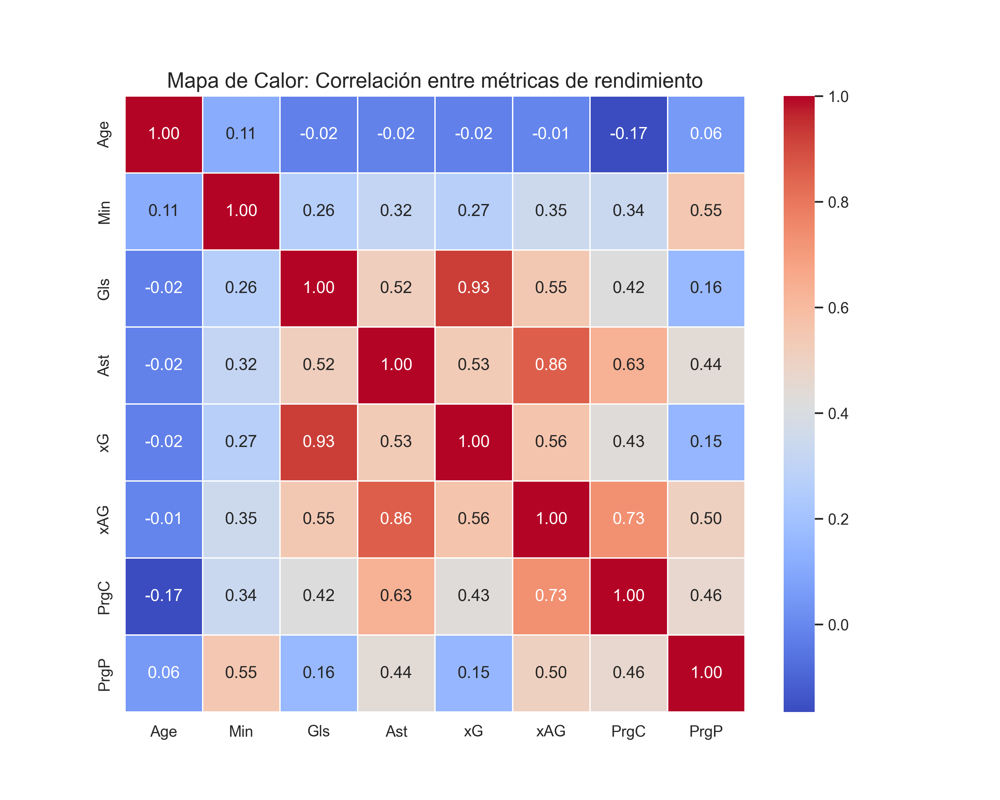

# ⚽ Football Data Analytics: Eficiencia y Progresión (Top 5 Ligas Europeas)

Este proyecto realiza un análisis avanzado de rendimiento de futbolistas de las cinco grandes ligas europeas (Premier League, La Liga, Serie A, Bundesliga, Ligue 1) durante la temporada 23/24.

El objetivo es identificar jugadores "fuera de serie" mediante el uso de métricas esperadas (**xG, xAG**) y estadísticas de progresión de balón (**PrgP**).

## 📊 Áreas de Análisis

### 1. Eficiencia Goleadora (Goles vs xG)
Analizamos quiénes son los finalizadores más clínicos. Un diferencial positivo indica que el jugador marca más de lo que la probabilidad estadística sugiere.
* **Destacados:** Alexander Sørloth y Phil Foden muestran una capacidad de finalización élite.

### 2. Capacidad de Creación (Asistencias vs xAG)
Evaluamos la calidad del último pase. Identificamos a los "asistentes frustrados": jugadores que generan grandes ocasiones que sus compañeros no logran convertir.

### 3. Motores del Juego (Pases Progresivos)
Identificamos a los arquitectos del juego. Jugadores con un alto volumen de **PrgP** son fundamentales para romper líneas defensivas y llevar el balón al último tercio.

## 🛠️ Tecnologías Utilizadas
* **Python 3.13**
* **Pandas:** Limpieza y manipulación de grandes volúmenes de datos.
* **Seaborn & Matplotlib:** Visualizaciones de datos profesionales (Scatter plots y Heatmaps).
* **Jupyter Notebook:** Documentación interactiva del proceso.

## 📂 Estructura del Proyecto
* `data/raw/`: Dataset original con las estadísticas de los jugadores.
* `notebooks/`: Proceso de limpieza, filtrado y análisis.
* `visuals/`: Gráficos exportados listos para informes.

## 📈 Visualización Destacada
* Gráficos como el siguiente entre otros.

*El mapa de calor confirma la fuerte relación entre la progresión del balón y la creación de peligro real.*
