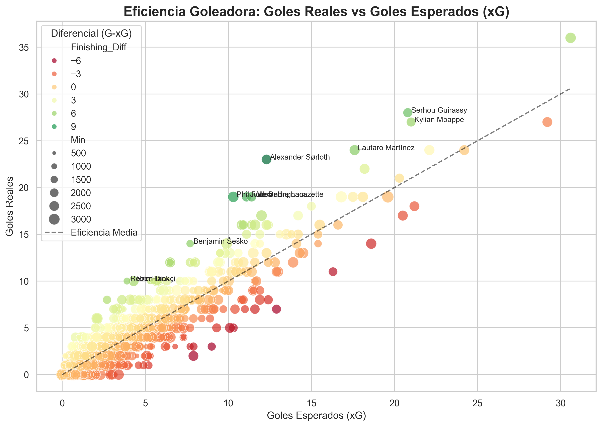

# ⚽ Football Analytics: Eficiencia y Progresión (Top 5 Ligas)

Este proyecto utiliza Python y Pandas para analizar el rendimiento de los futbolistas en la temporada 23/24. 

## 🔍 ¿Qué analiza este proyecto?
* **Eficiencia Goleadora**: Quiénes son los finalizadores más letales comparando Goles vs xG.
* **Capacidad de Creación**: Análisis de asistentes mediante xAG (Expected Assisted Goals).
* **Motores del Juego**: Identificación de jugadores clave en la progresión del balón (PrgP).

## 📊 Visualizaciones
* Gráficos como el siguiente entre otros

*Descripción: Comparativa de goles reales frente a la probabilidad estadística.*

## 🛠️ Tecnologías
- Python (Pandas, Matplotlib, Seaborn)
- Jupyter Notebooks
